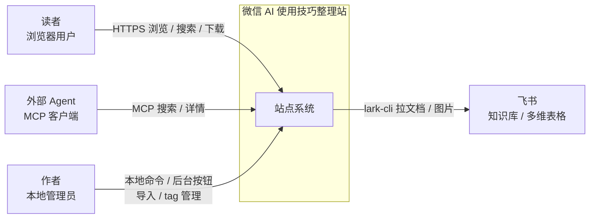
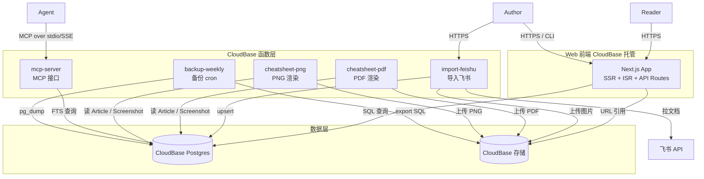

# Context Diagram — 微信 AI 使用技巧整理站

> Stage 04 交付物。C4 风格的系统上下文 + 容器图。

## Level 1 — System Context

## Level 2 — Container

## 容器清单

| 容器 | 技术 | 职责 |
|---|---|---|
| Next.js App | Next.js 15 App Router | 读者浏览、搜索、作者后台 |
| import-feishu | CloudBase 函数 + TypeScript | 飞书导入 |
| cheatsheet-pdf | CloudBase 函数 + puppeteer | PDF 渲染 |
| cheatsheet-png | CloudBase 函数 + puppeteer | PNG 渲染 |
| mcp-server | CloudBase 函数 + MCP SDK | MCP 接口 |
| backup-weekly | CloudBase cron 函数 | 备份 |
| CloudBase Postgres | Postgres 16 | 业务数据 |
| CloudBase 存储 | 对象存储 | 截图 / Cheat Sheet / 备份 |