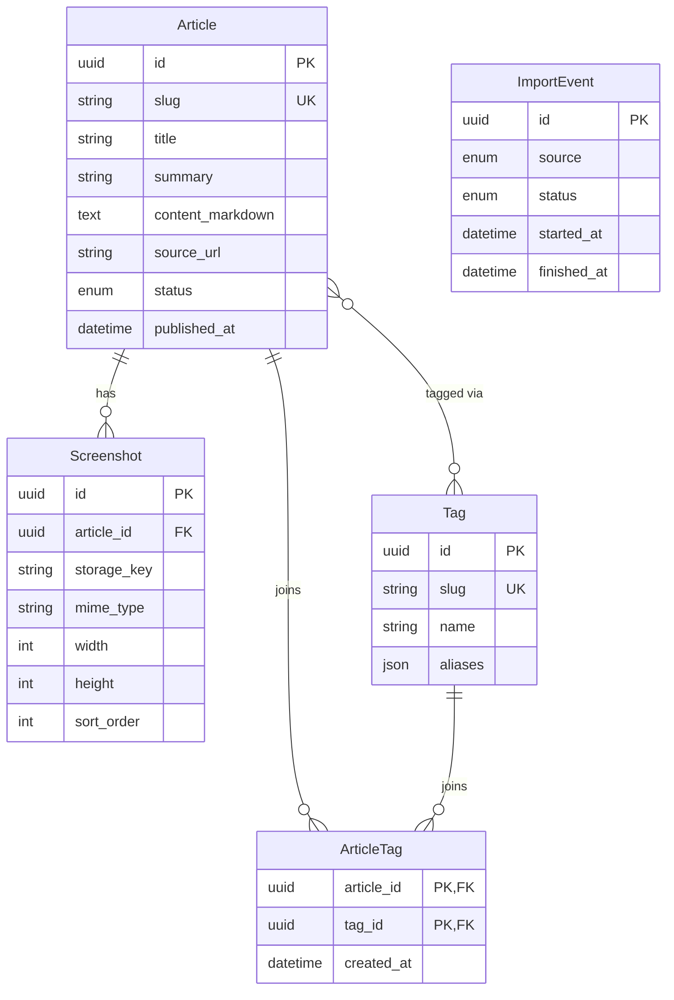

# Domain Model — 微信 AI 使用技巧整理站

> Stage 03 交付物。**技术中立**——不绑定 Postgres / CloudBase / 飞书 API 结构。

## 1. 核心实体（Entities）

### Article（文章）
聚合根。代表一篇「微信 AI 使用技巧」。

| 字段 | 类型 | 说明 |
|---|---|---|
| id | UUID | 内部唯一标识 |
| slug | Slug | URL 友好；同一文章唯一 |
| title | string(1–120) | 标题 |
| summary | string(0–300) | 摘要；搜索结果与图卡片用 |
| content_markdown | Markdown | 正文 |
| source_url | URL | 飞书原文链接（外部可追溯） |
| status | enum | draft / published / archived |
| published_at | datetime | status=published 时必填 |
| created_at, updated_at | datetime | |

### Tag（标签）
聚合根。代表一个内容分类。

| 字段 | 类型 | 说明 |
|---|---|---|
| id | UUID | |
| slug | Slug | 同一 tag 唯一 |
| name | string | 展示名（可中文） |
| aliases | string[] | 别名（合并历史保留，避免外链失效） |
| description | string(0–500) | 可选描述 |

### Screenshot（截图）
属于 Article 的实体。

| 字段 | 类型 | 说明 |
|---|---|---|
| id | UUID | |
| article_id | FK(Article) | 必属某篇 |
| storage_key | string | 存储系统内的 key（URL 由基础设施解析） |
| mime_type | string | image/png / image/jpeg / image/webp |
| width, height | int | |
| alt_text | string | 无障碍用 |
| ocr_text | string? | v1.1 可选；当前不用 |
| sort_order | int | 在文章中的顺序 |

### ArticleTag（关联）
多对多关联。**领域对象，不是 join-only 表**——合并 / 重命名都通过它实现。

| 字段 | 类型 | 说明 |
|---|---|---|
| article_id | FK(Article) | |
| tag_id | FK(Tag) | |
| created_at | datetime | |

### ImportEvent（导入事件）
不可变的领域事件，记录一次导入的输入与产出。

| 字段 | 类型 | 说明 |
|---|---|---|
| id | UUID | |
| source | enum | feishu (v1.0) |
| started_at, finished_at | datetime | |
| status | enum | running / succeeded / failed |
| counts | object | {added, updated, skipped, failed} |
| errors | ErrorEntry[] | 失败明细 |

## 2. 值对象（Value Objects）

### Slug
- 规则：小写 + 连字符；中文允许但建议英文优先；`^[a-z0-9-]{2,80}$` 或 `[\\u4e00-\\u9fa5-]{2,40}$`
- 唯一性：Article 和 Tag 各自唯一
- 生成：标题 → slugify（去特殊字符、空格转连字符）；冲突追加 `-2` / `-3`

### Markdown
- 内容契约：标准 CommonMark；可包含代码块、表格、图片引用
- 图片语法：`` 或引用 storage URL
- 渲染端负责转换

## 3. 领域关系图

## 4. 关键决策与边界
- **领域不分前后端**：Article / Tag / Screenshot 是同一份真相；前端展示只是视图
- **不暴露存储 URL**：领域只持有 `storage_key`；URL 解析属于基础设施层（防腐层）
- **ImportEvent 不替代领域**：仅审计与排错用，不参与业务逻辑
- **CheatSheet 是派生值**：不存表，按需从 Article + Screenshot 渲染
- **OCR / 阅读量等可观测数据**：v1.1 再说

## 5. 与现有飞书 / CloudBase 结构的映射（待 Stage 04 落地）
| 领域 | 飞书侧 | CloudBase 侧 |
|---|---|---|
| Article | docx / wiki 节点 | Postgres `articles` 表 |
| Tag | base 单选 / 多选字段 | Postgres `tags` 表 |
| Screenshot | docx 内嵌图片 | CloudBase 存储 + `screenshots` 表 |
| ArticleTag | base 关联 | Postgres `article_tags` 表 |
| ImportEvent | — | Postgres `import_events` 表 |