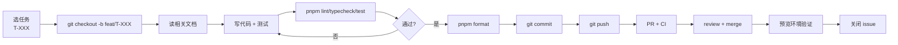

# IMPLEMENTATION-GUIDE — 微信 AI 使用技巧整理站

> Stage 08 交付物。实施期开发者守则。

## 1. 开工前必读

```
1. README.md              ← 项目入口
2. AGENTS.md              ← 命令 + 禁止事项
3. docs/IMPLEMENTATION-PLAN.md  ← 49 个任务清单
4. docs/DOMAIN-INVARIANTS.md    ← 不可破的规则
5. docs/openapi.yaml      ← API 契约
6. docs/MCP-CONTRACT.md   ← MCP 契约
7. 当前任务的 Task ID 对应的验收条件
```

## 2. 工作流（每个任务）



## 3. 编码约定

### 命名
- React 组件：PascalCase（`ArticleCard.tsx`）
- 工具函数：camelCase（`formatDate.ts`）
- 类型 / 接口：PascalCase（`ArticleSummary`）
- 常量：UPPER_SNAKE（`MAX_PAGE_SIZE`）
- 数据库表：snake_case + 复数（`articles`, `article_tags`）
- SQL 列：snake_case（`published_at`）

### TypeScript
- 严格模式开启（`strict: true`）
- 禁止 `any`（如必要用 `unknown` + 类型守卫）
- 公共 API 必须有显式返回类型
- 用 `import type` 区分类型与值导入

### React
- 默认 Server Component；需要交互的加 `"use client"`
- 数据获取放在 Server Component；客户端组件用 props 接收
- 不在 Client Component 直接调用数据库

### 数据库
- 所有 SQL 必须参数化（防注入）
- 事务边界清晰（一段业务 = 一个事务）
- 不在生产数据库上跑 `DROP` / `TRUNCATE`
- 迁移文件可重复执行（`CREATE IF NOT EXISTS` / `ADD COLUMN IF NOT EXISTS`）

## 4. 测试要求

每个任务的代码必须含：

| 类型 | 覆盖范围 | 工具 |
|---|---|---|
| 单元测试 | 业务逻辑 / 工具函数 | Vitest |
| 组件测试 | React 组件交互 | Testing Library + Vitest |
| 集成测试 | API route + DB | Vitest + testcontainers |
| E2E 测试 | 用户关键旅程 | Playwright |

最低覆盖：
- 新 API 接口：≥ 1 集成测试 + 1 E2E
- 新组件：≥ 1 组件测试
- 新业务逻辑：≥ 1 单元测试 + 边界值

## 5. PR 模板

```markdown
## 任务
- Task ID: T-XXX
- 切片: S-X

## 变更
- ...

## 验证
- [ ] pnpm lint
- [ ] pnpm typecheck
- [ ] pnpm test
- [ ] pnpm test:e2e (如适用)
- [ ] 预览环境手动验证

## 风险
- ...

## 文档同步
- [ ] docs/openapi.yaml (如 API 变更)
- [ ] docs/MCP-CONTRACT.md (如 MCP 变更)
- [ ] ADR 新增 (如架构决策)
- [ ] db/migrations 新增 (如 schema 变更)
```

## 6. 实施顺序建议

按 IMPLEMENTATION-PLAN §4 依赖图顺序。建议单人节奏：

```
W1 Mon-Tue: S-0（基础设施）
W1 Wed-Fri: S-1（导入）
W2 Mon-Wed: S-2（阅读）
W2 Thu-Fri: S-3（搜索）
W3 Mon-Wed: S-4（标签）
W3 Thu-Fri: S-5（MCP）
W4 Mon-Tue: S-6（备份）
W4 Wed: S-7（部署）
W4 Thu-Fri: S-8（验收）
```

## 7. 常见陷阱

- ❌ 不要把 Next.js `fetch` 缓存配置误用 — 默认不缓存；ISR 用 `next: { revalidate: 300 }`
- ❌ 不要在 Server Component 用 hooks
- ❌ 不要让 CloudBase 函数超时（3s）— 长任务移到定时触发
- ❌ 不要直接拼 Markdown（XSS 风险）— 用 `react-markdown` + DOMPurify
- ❌ 不要把 MCP Bearer Token 写进前端 — 仅服务端用
- ❌ 不要忘记 Origin 头校验（MCP 安全要求）

## 8. 何时停下求助

- 同一 bug 调试 > 2h：停下，写复现最小用例，问同事/AI
- 设计偏离 PRD：回 Stage 02 修订；不要悄悄改业务语义
- 数据丢失风险：立即停止操作，联系作者
- 安全告警：立即停止公开部署

## 9. 完成定义（DoD）

- [ ] 代码通过所有质量门
- [ ] 文档同步
- [ ] 预览环境验证通过
- [ ] PR 被 review 通过
- [ ] Issue 关闭（含 commit SHA）