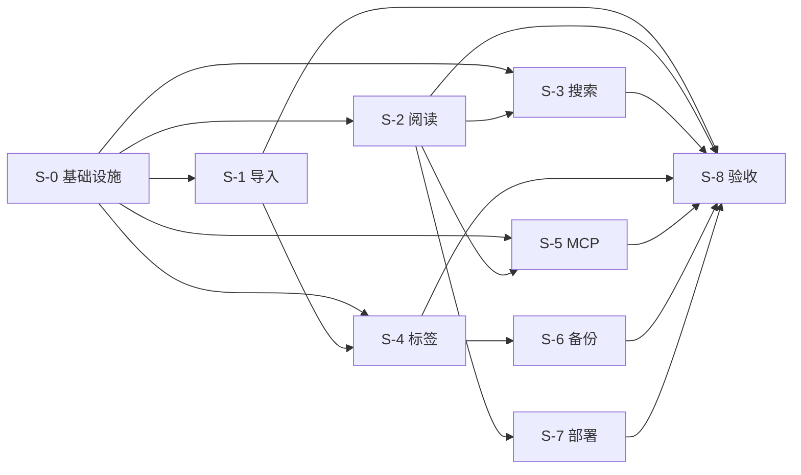

# IMPLEMENTATION-PLAN — 微信 AI 使用技巧整理站

> Stage 07 交付物。任务拆分、依赖图、并行计划。

## 1. 拆分原则

按**用户可见垂直切片**拆，不是按技术分层。每片都是端到端可演示的小流程。

## 2. 切片总览

| 切片 | 编号 | 涉及 | 估时 | 风险 |
|---|---|---|---|---|
| 基础设施就绪 | S-0 | CloudBase 环境 / DB / Storage / 凭证 | 1d | 中 |
| 数据导入 | S-1 | 飞书 API / DB upsert / ISR revalidate | 2d | 中 |
| 阅读浏览 | S-2 | 列表页 / 详情页 / ISR | 1.5d | 低 |
| 全文搜索 | S-3 | FTS / API / UI | 1d | 中 |
| 标签管理 | S-4 | 后台 CRUD / 合并 / 重命名 / UI | 2d | 中 |
| MCP 接入 | S-5 | CloudBase 函数 + Streamable HTTP + 3 tools | 2d | 中 |
| 备份与监控 | S-6 | cron 函数 / 告警 / 日志 | 0.5d | 低 |
| 公网部署 + 域名 | S-7 | CloudBase 静态托管 + 自定义域名 | 1d | 低 |
| 验收 / E2E | S-8 | Playwright / 性能测试 / G1-G7 门槛 | 1d | 低 |
| **合计** | | | **12d** | |

## 3. 各切片详细任务

### S-0 基础设施就绪（依赖：无）
**目标**：CloudBase 环境可用、Postgres 可连、存储可用、凭证安全。

| ID | 任务 | 验收 | 涉及 |
|---|---|---|---|
| T-001 | 创建 CloudBase FREE 环境 | 控制台可见 | CloudBase 控制台 |
| T-002 | 开通 Postgres + 应用 0001_init.sql | 5 张表存在 | CloudBase PG + 迁移脚本 |
| T-003 | 创建存储桶 wx-ai-tips | 控制台可见 + 公开读权限 | CloudBase 存储 |
| T-004 | 配置 GitHub Secrets（CLOUDBASE_*） | secrets 已设置 | GitHub |
| T-005 | 本地 docker compose up + db:migrate 成功 | 5 张表存在 | docker-compose + scripts/migrate.ts |
| T-006 | 配置 .env.local 真实值 | dev 启动无错 | .env.local |

**风险**：CloudBase 控制台访问需在国内网络

---

### S-1 数据导入（依赖：S-0）
**目标**：从飞书知识库 / 多维表格拉取 → 入库 → ISR 失效 → 公网可见。

| ID | 任务 | 验收 | 涉及 |
|---|---|---|---|
| T-101 | 写飞书 lark-client 适配层（lark-cli 封装）| 单测通过 | lib/adapters/lark-client.ts |
| T-102 | 写导入函数 import-feishu（拉文档 → 解析 Markdown → 提取图片）| 单元测试 + 沙箱集成 | cloudbase-functions/import-feishu/ |
| T-103 | 图片下载 → 上传 CloudBase 存储 | 截图可见 | lib/adapters/storage.ts |
| T-104 | 写 Article + Tag + ArticleTag + Screenshot upsert | 事务原子 | lib/repositories/article-repo.ts |
| T-105 | 导入完成后触发 ISR revalidate | CloudBase 函数调用成功 | cloudbase-functions/import-feishu/ |
| T-106 | 写 ImportEvent 审计 + 错误明细 | 失败可查 | lib/repositories/import-event-repo.ts |
| T-107 | 端到端：导入 5 篇 → 公网可见 | 浏览器访问详情页 OK | E2E test |

**风险**：飞书 API 限流（IR-8）；截图打码（IR-11）

---

### S-2 阅读浏览（依赖：S-0）
**目标**：读者能浏览列表 + 详情，截图正常显示。

| ID | 任务 | 验收 | 涉及 |
|---|---|---|---|
| T-201 | 设计主页（精选 + 最新 + 热门 tag）| Figma 设计稿（可选）| app/page.tsx |
| T-202 | 列表页 /articles | 倒序展示 + tag 过滤 | app/articles/page.tsx |
| T-203 | 详情页 /articles/[slug] | Markdown 渲染 + 截图懒加载 | app/articles/[slug]/page.tsx |
| T-204 | tag 页 /tags/[slug] | 展示该 tag 下文章 | app/tags/[slug]/page.tsx |
| T-205 | 404 / 410 处理 | archived 显示「已下架」| app/articles/[slug]/not-found.tsx |
| T-206 | ISR 缓存 60s/300s | CloudBase 控制台 revalidate 命中 | next.config + fetch 标记 |
| T-207 | SEO meta + sitemap.xml + robots.txt | Lighthouse SEO ≥ 95 | app/sitemap.ts |

---

### S-3 全文搜索（依赖：S-0, S-2）
**目标**：搜索框能查到相关文章。

| ID | 任务 | 验收 | 涉及 |
|---|---|---|---|
| T-301 | DB 端 search_tsv 索引已有（0001_init）| \d articles 可见 | db/migrations/0001_init.sql |
| T-302 | GET /api/search 实现（FTS + ranking）| P95 < 300ms | app/api/search/route.ts |
| T-303 | 顶栏搜索框 + 实时 debounce 300ms | UX 流畅 | components/SearchBox.tsx |
| T-304 | 搜索结果页 /search | 显示 Top 20 | app/search/page.tsx |
| T-305 | 零结果友好提示 | 显示「没找到相关文章」| components/SearchResults.tsx |

**风险**：simple 词典对中文分词弱（v1.1 评估 zhparser）

---

### S-4 标签管理（依赖：S-0, S-1）
**目标**：作者后台能 CRUD / 合并 / 重命名 tag。

| ID | 任务 | 验收 | 涉及 |
|---|---|---|---|
| T-401 | IP 白名单中间件 | 非白名单 403 | middleware.ts |
| T-402 | POST /api/admin/tags 创建 | 201 + slug unique 检查 | app/api/admin/tags/route.ts |
| T-403 | PUT /api/admin/tags/{slug} 重命名（保留 alias）| 旧 slug 301 → 新 slug | app/api/admin/tags/[slug]/route.ts |
| T-404 | POST /api/admin/tags/merge 事务 | DB 事务原子 + toSlug 不在 fromSlugs | app/api/admin/tags/merge/route.ts |
| T-405 | DELETE /api/admin/tags/{slug}?force=true | force 才允许直接删 | app/api/admin/tags/[slug]/route.ts |
| T-406 | 后台 UI /admin/tags | CRUD + 合并向导 | app/admin/tags/page.tsx |
| T-407 | Tag 频率云视图 | 显示 count + 占比 | components/TagCloud.tsx |

**风险**：合并事务并发（需锁）

---

### S-5 MCP 接入（依赖：S-0, S-2）
**目标**：外部 Agent 通过 Streamable HTTP 调三个 tool。

| ID | 任务 | 验收 | 涉及 |
|---|---|---|---|
| T-501 | 实现 mcp-server CloudBase HTTP 函数 | MCP Inspector 联通 | cloudbase-functions/mcp-server/ |
| T-502 | Tool: search_articles | 联通 + 返回 Top N | 同上 |
| T-503 | Tool: get_article | 仅返回 published | 同上 |
| T-504 | Tool: list_tags | 按 prefix 过滤 | 同上 |
| T-505 | Origin 校验 + Bearer Token 鉴权 | 非法请求 403 | 同上 |
| T-506 | 速率限制 200 RPM | 超限 429 | middleware |
| T-507 | Claude Desktop / Cursor 客户端配置示例 | 文档完整 | docs/MCP-CONTRACT.md |

---

### S-6 备份与监控（依赖：S-0, S-1）
**目标**：周备 cron + 监控告警。

| ID | 任务 | 验收 | 涉及 |
|---|---|---|---|
| T-601 | backup-weekly 函数（pg_dump → 存储）| 备份文件可恢复 | cloudbase-functions/backup-weekly/ |
| T-602 | cron 配置（每周日 03:00）| 自动触发 | CloudBase 控制台 |
| T-603 | 5xx 告警（CloudBase 监控 → 邮箱）| 测试告警收到 | CloudBase 监控 |
| T-604 | 用量告警（> 80%）| 测试告警收到 | CloudBase 监控 |
| T-605 | 备份恢复演练（季度）| 文档化 | docs/VENDOR-LOCK-IN-REVIEW.md |

---

### S-7 公网部署 + 域名（依赖：S-2）
**目标**：公网可访问。

| ID | 任务 | 验收 | 涉及 |
|---|---|---|---|
| T-701 | 申请自定义域名 | 域名已备案（如需）| DNS 服务商 |
| T-702 | CloudBase 静态托管绑定域名 | HTTPS 可访问 | CloudBase 控制台 |
| T-703 | DNS 解析 | ping OK | DNS 服务商 |
| T-704 | Lighthouse 性能 ≥ 90 | 审计通过 | Chrome DevTools |
| T-705 | sitemap 提交百度 / Google | 已提交 | Google Search Console |

---

### S-8 验收 / E2E（依赖：所有切片）
**目标**：G1-G7 发布门槛全部达成。

| ID | 任务 | 验收 | 涉及 |
|---|---|---|---|
| T-801 | G1 内容：≥ 20 篇首发 + 截图无 PII | 人工抽查 | docs/ACCEPTANCE-CRITERIA.md |
| T-802 | G2 功能：US-1 ~ US-7 全部通过 | E2E 全绿 | playwright |
| T-803 | G3 性能：列表 / 搜索 / Cheat Sheet P95 | k6 跑 | k6 |
| T-804 | G4 安全：写接口白名单 + MCP 只读 + SOP | 渗透测试 | manual |
| T-805 | G5 备份：周备 + 恢复演练 | 演练 OK | manual |
| T-806 | G6 文档：README + INFRASTRUCTURE-PLAN + COST + LOCK-IN | 检查清单 | manual |
| T-807 | G7 监控：5xx + 用量 + MCP 失败率 | 告警配置 | CloudBase 监控 |

## 4. 依赖图



## 5. 并行计划

| 周 | 可并行切片 |
|---|---|
| W1 | S-0（前置 1 天） → S-1 + S-2 并行 |
| W2 | S-3（依赖 S-2 数据） + S-5（依赖 S-2 数据）并行 |
| W3 | S-4（依赖 S-1 已有 tag 数据） |
| W4 | S-6 + S-7 + S-8 验收 |

> 单人维护时实际串行；本表展示理想并行能力，便于多人协作场景。

## 6. 高风险任务清单（建议先做 spike）

| 任务 | 风险 | Spike 内容 |
|---|---|---|
| T-001 ~ T-006 | CloudBase 控制台访问受限 | 先在 CloudBase 网页跑通环境创建 |
| T-103 | CloudBase 存储上传下载 API | 写 1 个 demo 函数验证 |
| T-302 | Postgres FTS 中文分词效果 | 准备 5 篇测试文章，搜 5 个关键词看命中 |
| T-501 | MCP Streamable HTTP 在 CloudBase 函数 | 写最小 demo，curl 测试 |
| T-701 | 域名备案 | 提前 7-15 天申请 |

## 7. 任务跟踪

GitHub Issues 模板（每个任务一个 issue）：

```yaml
# .github/ISSUE_TEMPLATE/task.yml
name: Task
description: 标准任务 issue
labels: ["task"]
body:
  - type: dropdown
    id: slice
    options:
      - S-0 基础设施
      - S-1 导入
      - S-2 阅读
      - S-3 搜索
      - S-4 标签
      - S-5 MCP
      - S-6 备份
      - S-7 部署
      - S-8 验收
  - type: input
    id: estimate
    attributes:
      placeholder: "估时，如 0.5d"
  - type: textarea
    id: acceptance
    attributes:
      placeholder: "验收条件"
  - type: textarea
    id: files
    placeholder: "涉及文件"
```

## 8. 完成定义（DoD）

每个任务完成前必须：
- [ ] 代码通过 lint / typecheck / test
- [ ] 涉及 ADR / openapi.yaml 同步更新
- [ ] 新增功能有单元测试
- [ ] 涉及 schema 变更同步 0001_init.sql + 新迁移文件
- [ ] 文档（如涉及）已更新
- [ ] PR 通过 CI + 至少 1 人 review
- [ ] 部署到预览环境验证