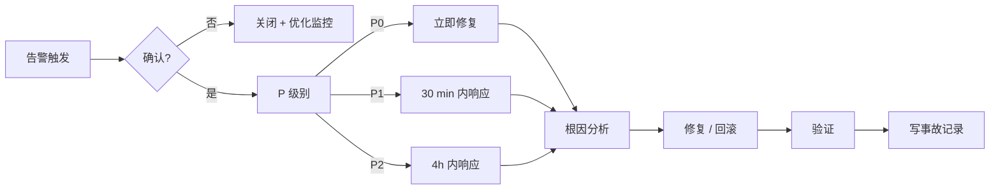

# OPERATIONS-RUNBOOK — 微信 AI 使用技巧整理站

> Stage 12 交付物。运营手册：日常维护、监控响应、故障处理。

## 1. 日常维护节奏

| 频率 | 任务 | 时间 |
|---|---|---|
| 每日 | 看监控大盘；处理告警 | 09:00 |
| 每周 | 看用量趋势；备份演练确认 | 周一 09:00 |
| 每月 | 依赖更新（pnpm update）；技术债审视 | 月初 |
| 每季度 | 回滚演练；锁定风险审视 | 季度初 |
| 每年 | CloudBase 政策 / 价格审视；AGENTS.md 更新 | 年初 |

## 2. 监控指标

### 2.1 错误率
- CloudBase 函数 5xx 错误率 < 1%
- 4xx 错误率 < 5%（搜索 404 算正常）
- MCP 调用失败率 < 2%

### 2.2 延迟
- API P95：列表 < 500ms / 搜索 < 300ms
- 函数 P95：所有 < 2s（保留 1s buffer 给 3s 超时）
- MCP P95：< 500ms

### 2.3 容量
- 数据库使用量 < 80%
- 存储使用量 < 80%
- 月资源点 < 80%（2500 / 3000）

### 2.4 业务
- 日活读者（CloudBase 分析）
- 日活 MCP 调用
- 周导入次数

## 3. 告警路由

| 告警级别 | 渠道 | 响应时间 |
|---|---|---|
| P0（站点不可用）| 短信 + 微信 | 5 分钟 |
| P1（核心功能故障）| 微信 | 30 分钟 |
| P2（次要功能 / 性能）| 邮件 | 4 小时 |
| P3（信息类）| 日报 | 工作时间内 |

详见 ALERTS.md。

## 4. 故障处理流程



## 5. 常见故障与处理

### F-1：5xx 错误率突增
1. 看 CloudBase 函数日志，过滤 5xx
2. 看 traceId 对应到具体错误
3. 常见原因：DB 超时、函数冷启动、外部 API 失败
4. 处理：
   - DB 超时 → 检查慢查询 → 加索引或迁移
   - 冷启动 → 加预置并发（升级套餐）
   - 外部 API → 加退避重试 / 切 Mock

### F-2：搜索无结果
1. 用 MCP Inspector 直接查 DB
2. 检查 `articles.search_tsv` 索引是否完整
3. 检查导入脚本是否写入了正确的 status='published'
4. 重新 build search_tsv：
   ```sql
   UPDATE articles SET title = title;  -- 触发 GENERATED 字段重算
   ```

### F-3：MCP 客户端报错 401
1. 检查 Bearer Token 是否过期
2. 检查 CloudBase 函数环境变量
3. 重启函数（新凭证生效）

### F-4：截图加载失败
1. 检查 storage_key 是否存在（curl HEAD）
2. 检查存储桶公开读权限
3. 检查 CDN 缓存（365 天可能过期）

### F-5：导入失败
1. 看 ImportEvent.errors
2. 飞书 sandbox 状态
3. 飞书 API 配额
4. 截图上传失败 → 检查 storage bucket
5. 重试：手动触发 `npm run import:feishu --mode=incremental`

## 6. 数据库维护

### 6.1 日常
- 自动备份已 cron 跑
- 每月看一次 pg_stat_statements（最慢查询）

### 6.2 应急
- 连接数满 → 检查是否有未关闭的连接池
- 锁等待 → 看 `pg_locks` + `pg_stat_activity`
- 磁盘满 → 清理旧备份 + 收缩 dead tuples（VACUUM）

## 7. 备份验证

每月一次手动验证：
1. 拉最近一次备份
2. 在本地 Docker Postgres 恢复
3. 跑数据完整性 SQL：
   ```sql
   SELECT
     (SELECT COUNT(*) FROM articles) AS articles,
     (SELECT COUNT(*) FROM tags) AS tags,
     (SELECT COUNT(*) FROM screenshots) AS screenshots;
   ```
4. 与 CloudBase PG 对比
5. 记录到 BACKUP-RESTORE.md

## 8. 安全事件

发现 P0/P1 安全事件：
1. 立即停止公开访问（暂停 CloudBase 静态托管）
2. 修改所有 Token / Secret
3. 审计日志查攻击范围
4. 修复后恢复
5. 写 INCIDENT-XXX

## 9. 成本监控

每月看 COST-REGISTER.md 数据：
- 用量 < 80% 套餐：✅
- 用量 80-100%：评估是否升级
- 用量 > 100%：已启用按量付费；评估是否升级
- 月费用 > ¥50：考虑 PERSONAL（¥19.9）

## 10. 值班与升级

- 值班：作者本人（无轮班）
- 升级：本项目无团队；如长期无人响应，临时迁移到归档模式（CloudBase 暂停环境）