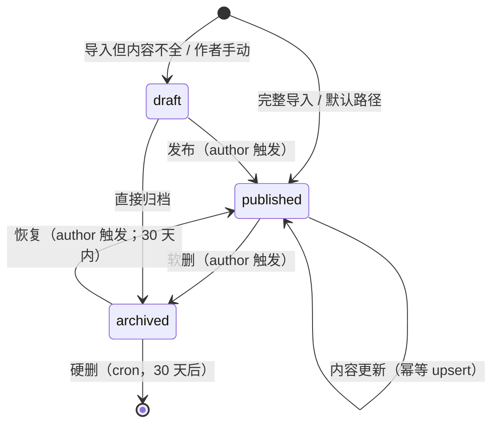
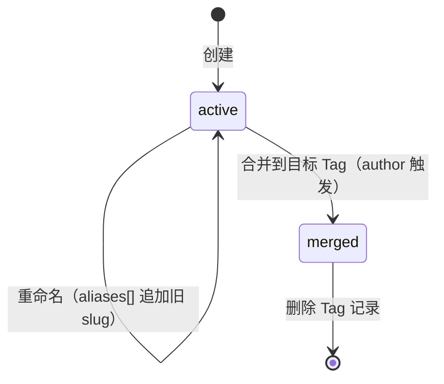
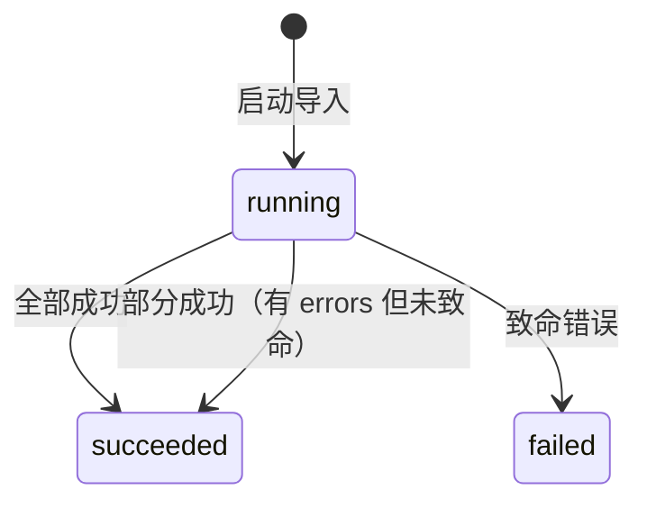
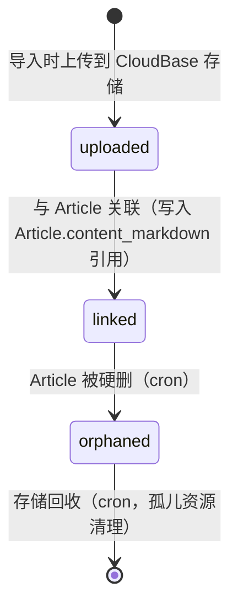

# State Machines — 微信 AI 使用技巧整理站

> Stage 03 交付物。定义核心实体的状态机。所有状态转换均需校验领域不变量。

## SM-1 Article 状态机

**转换规则**

| from | to | 触发者 | 前置条件 | 副作用 |
|---|---|---|---|---|
| (none) | published | 导入脚本 | 飞书文档完整 | 生成 slug、入库、上传截图 |
| (none) | draft | 导入脚本（罕见） | 飞书文档缺字段 | 写入 draft 字段 |
| draft | published | 作者 | title + content 非空 | 设置 published_at |
| published | published | 导入脚本 | slug 存在且内容有变 | upsert；published_at 不变 |
| published | archived | 作者 | — | 设置 archived_at；前端 410 |
| archived | published | 作者 | archived_at < 30 天 | 清空 archived_at；重新发布 |
| archived | (deleted) | cron | archived_at ≥ 30 天 | 删除 Article + Screenshot FK |

## SM-2 Tag 状态机

**转换规则**

| from | to | 触发者 | 前置条件 | 副作用 |
|---|---|---|---|---|
| (none) | active | 导入脚本 / 作者 | slug 唯一 | 写入 ArticleTag 关联 |
| active | active | 作者（重命名） | 新 slug 唯一 | aliases 追加旧 slug；301 重定向 |
| active | merged | 作者（合并） | 目标 Tag ≠ 自身 | 事务：所有 ArticleTag 转目标；删除本 Tag |

> **不允许的转换**
> - active → (deleted) 直接删除：必须先 merged 或 author 显式 force_delete
> - merged → active：合并后不可逆（外链靠 aliases 兜底）

## SM-3 ImportEvent 状态机

**关键点**
- ImportEvent 状态不可变：成功后只能新增记录，不能修改
- running 状态同一 source 不允许并发（分布式锁）
- failed 状态保留错误明细供排错

## SM-4 Screenshot 生命周期

**注意**
- Screenshot 没有独立 status 字段；状态由其关联上下文推导
- uploaded 未 linked 是中间态；若 1 小时内未 linked 则判定失败

## SM-5 权限状态（隐式）

无显式状态机，但每个接口标注：

| 接口 | 谁能调用 | 检查 |
|---|---|---|
| 公开读（GET /articles, /tags, /search） | 任何人 | 仅返回 published |
| 作者写（POST /import, /admin/tags） | 本地 / IP 白名单 | CloudBase 函数网络策略 |
| MCP 读（mcp.search_articles, mcp.get_article） | 任何 MCP 客户端 | 同公开读 + 速率限制 |
| MCP 写 | 不存在 | — |